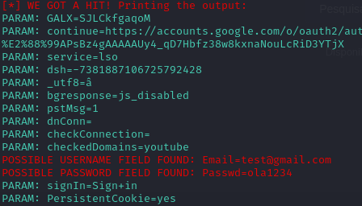

# Phishing para captura de senhas do Google

Este repositório foi criado com o objetivo de simular um ataque via phishing para captura de senhas como parte do desafio proposto no Bootcamp de Cibersegurança. 

### Ferramentas

- Kali Linux
- setoolkit

### Configurando o Phishing no Kali Linux

- Acesso root: ``` sudo su ```
- Iniciando o setoolkit: ``` setoolkit ```
- Tipo de ataque: ``` Social-Engineering Attacks ```
- Vetor de ataque: ``` Web Site Attack Vectors ```
- Método de ataque: ```Credential Harvester Attack Method ```
- Método de ataque: ``` Web Templates ```
- Método de ataque: ``` Google ```


### Resutados


